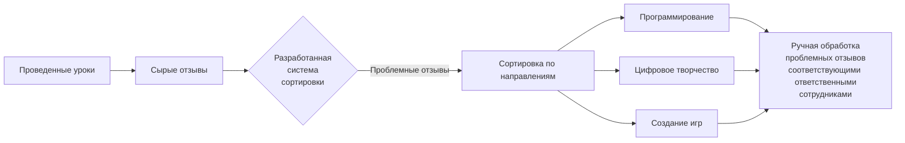

# Автоматизация обработки отзывов на занятия в онлайн-школе

**Разработка системы автоматизированной обработки сырых отзывов о занятиях в онлайн-школе с использованием методов машинного обучения**

## Описание проекта

В онлайн-школе программирования для детей ежедневно накапливается большое количество текстовых отзывов от преподавателей. Отзывы содержат числовую оценку (от 1 до 5), могут содержать текстовый комментарий и хранятся в Google Sheets. **Ручная сортировка сырой обратной связи требовала около 30 минут ежедневных трудозатрат сотрудника-методиста и включала в себя большое количество рутинных действий по переносу отзывов в другие таблицы**.

**Цель проекта** - разработать автоматическую систему, которая:
- классифицирует каждый отзыв как **«требующий внимания»** или **«не требующий»**;
- автоматически выгружает проблемные отзывы в отдельные таблицы через Google Sheets API для последующей ручной обработки.



### **Результат**:

Система успешно реализована и внедрена. Это позволило сократить время, затрачиваемого сотрудником на первичную сортировку, **с 2.5ч до 15-20 минут** в неделю(более чем в 7 раз).

> Оставшиеся 15-20 минут необходимы для проверки результатов работы системы в связи с неоднозначностью текстовых комментариев и субъективизмом преподавателей в отзывах.

## Архитектура системы

```text
review_processing_system/
├── config/
│   ├── __init__.py
│   ├── settings.py           # Константы: ID таблиц, пороги, пути
│   └── keywords.txt          # Список ключевых слов
├── course_lists/             # Списки курсов по направлениям (.txt)
│   ├── programming_courses.txt
│   ├── art_courses.txt
│   ├── game_courses.txt
│   └── robots_courses.txt
├── credentials/              # Чувствительные данные (в .gitignore!)
│   └── credentials_all.json
├── data/
│   ├── raw/                  # Исходные датасеты
│   ├── labeled/              # Размеченные данные для обучения
│   └── models/               # Сохранённые модели (.pkl)
├── logs/                     # Логи работы системы
│   └── processing.log
├── scripts/                  # Скрипты автоматизации
│   ├── train_model.py        # Обучение модели
│   └── run_processing.py     # Запуск обработки по расписанию
├── src/                      # Основной исходный код
│   ├── __init__.py
│   ├── main.py               # Точка входа
│   ├── google_sheets_client.py
│   ├── text_preprocessor.py
│   ├── feature_extraction.py
│   ├── ml_model.py
│   ├── rule_engine.py        # Логика правил и ключевых слов
│   ├── classification_pipeline.py
│   ├── course_matcher.py     # Определение направления курса
│   ├── data_processor.py     # Главный пайплайн обработки
│   └── utils.py
├── tests/                    # Модульные тесты
│   ├── test_preprocessor.py
│   └── test_rule_engine.py
├── .gitignore
├── README.md                 # Описание проекта и инструкция
├── requirements.txt          # Зависимости проекта
└── setup.py                  # Конфигурация установки (опционально)
```

## Используемые методы

- **TF-IDF** – преобразование текста в числовые векторы.
- **Логистическая регрессия** – базовый классификатор, обучен на 15 000 размеченных отзывах (80/20 split). Датасет был собран вручную на основе исторических данных.
- **Эвристические правила**:
  - если оценка < 5 → отзыв проблемный;
  - если найдены ключевые слова (`ошибка`, `не работает`, `непонятно`, `сломано`, `проблема`, `баг`) → проблемный;
  - итоговое решение = OR (модель + низкая оценка + ключевые слова).
- **Порог уверенности модели** – 0.6.

## Результаты тестирования

Тестирование проводилось на отложенной выборке из **500 отзывов**.

Пример работы:

|**Текст отзыва** |	**Оценка** |	**Решение** |
|------------|----------|----------|
|Отличное занятие, все понятно! |	5	| Не требует обработки|
|Все нормально, но код можно сделать оптимальнее |	4	| Требует обработки (низкая оценка)|
|Детям было интересно, но в уроке были небольшие ошибки |	5 |	Требует обработки (ключевое слово "ошибки")|

| Метрика    | Значение |
|------------|----------|
| Accuracy   | 0.93     |
| Precision  | 0.85     |
| Recall     | 0.82     |

Результаты согласованы и признаны достаточными для использования в работе.

## Технологии

- **Язык**: Python 3
- **Библиотеки**:
  - `pandas` – обработка таблиц
  - `scikit-learn` – модель ML (TF-IDF, логистическая регрессия)
  - `nltk` – лемматизация, стоп-слова
  - `google-api-python-client` – работа с Google Sheets
  - и некоторые другие, полный список в `requirements.txt`
- **API**: Google Sheets API
- **Планировщик**: ОС Windows (Task Scheduler)

## Установка и запуск

### 1. Установка зависимостей
```bash
pip install -r requirements.txt
```

### 2. Настройка доступа к Google Sheets

- Создайте сервисный аккаунт в Google Cloud Console.
- Включите Google Sheets API.
- Скачайте JSON-ключ и поместите его в папку проекта.
- Предоставьте доступ к целевой таблице email-адресу сервисного аккаунта.

### 3. Настройка конфигурации

В файле config.py укажите:

- ID Google Sheets документа
- Диапазон ячеек
- Путь к JSON-ключу
- Порог оценки и список ключевых слов

### 4. Проверьте актуальность списка курсов в `course_lists/`

### 5. Запустите обучение на размеченных данных
```bash
python scripts/train_model.py --data labeled_reviews.csv
```

### 6. Запуск обработки

```bash
python scripts/run_processing.py
```

### 7. Настройка автоматического выполнения обработки

Настройте планировщик задач для ежедневного выполнения main.py. Видеоинструкция доступна по [ссылке](https://www.youtube.com/watch?v=T9A8TelGsdo&ab_channel=Jean-ChristopheChouinard).